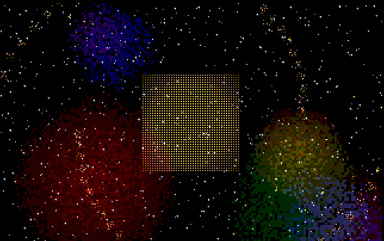
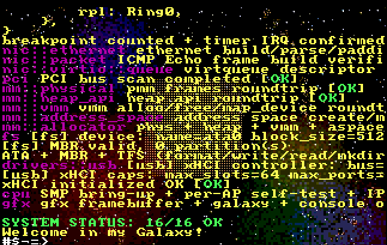
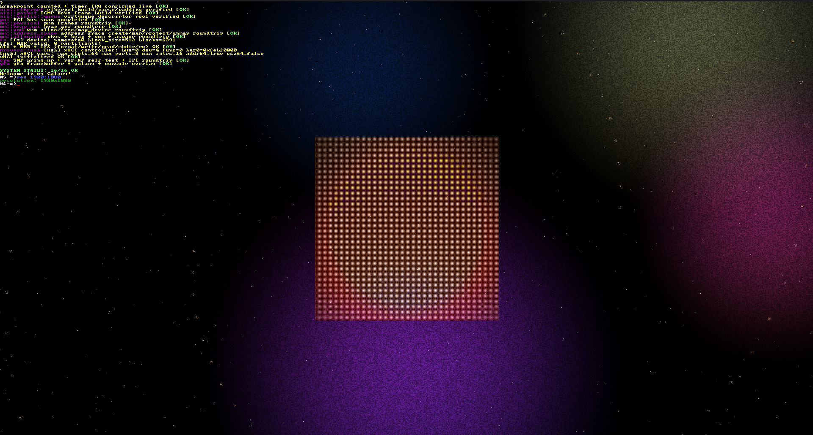

# TrangorgeOS

# TrangorgeOS

> A modern, high-performance bare-metal operating system built ground-up on a custom **Separated Tri-Partition Architecture** (*Architektura Trójpodziału Rozdzielnego*).

---

## Overview & Philosophy

TrangorgeOS is built with a strict **from-scratch philosophy** (~35,000+ lines of code, actively expanding). It discards classic microkernel overhead and hybrid kernel bloat in favor of a strictly isolated, policy-enforced driver architecture. 

The project operates under an intensive development cycle aimed at producing a stable, bare-metal kernel fully functional on physical hardware.

---

## Visuals & Screenshots

| Kernel Loading & Memory Allocation Testing | Kernel Base Resolution | Kernel in 1080p |
|:---:|:---:|:---:|
|  |  |  |

---

## Architectural Model: Separated Tri-Partition Architecture

TrangorgeOS decouples driver functionality and system privilege into 4 distinct operational layers (3 main domains + userspace abstraction):


```

+-----------------------------------------------------------------+
|                         USERSPACE                               |
|   - Applications & High-Level Libraries                         |
+-----------------------------------------------------------------+
|                   USER DRIVER SPACE (UDS)                       |
|   - High-risk / Peripherals (Fault-isolated, strict boundary)   |
+-----------------------------------------------------------------+
|                     DRIVER SPACE (DS)                           |
|   * Dynamic Drivers   : GPU & complex hardware                  |
|   * Static Drivers    : Init & single-action hardware setup       |
|   * Library Drivers   : Inter-driver interface providers        |
+-----------------------------------------------------------------+
|                    KERNEL CORE / DRIVERS                        |
|   - Trusted Core Drivers (Network, USB stack base, Core MM)     |
|   - Fine-grained Kernel Policy Enforcement & Data Flow Control  |
+-----------------------------------------------------------------+

```

1. **Kernel Core & Trusted Drivers:** Holds only maximum-trust drivers (e.g., base network, USB stack core) to eliminate IPC latency for essential paths without compromising core stability. Exports explicit system interfaces.
2. **Driver Space (DS):** Modular driver execution environment with strict error margins:
   - **Dynamic Drivers:** Handle complex, stateful hardware (e.g., GPU control).
   - **Static Drivers:** Perform hardware initialization or non-exporting, single-purpose setup.
   - **Library Drivers:** Expose specialized interfaces (e.g., PCI, HDMI control) for other drivers to consume.
3. **User Driver Space (UDS):** High-level peripheral drivers isolated at a safe distance from the core to prevent system crashes on fault.
4. **Userspace & User Library Drivers:** Top-level space housing application runtime and user-level library interfaces.

---

## Current Subsystems & Refactoring Status

> **Notice:** The kernel is currently undergoing a major refactoring phase (modernization and safety audit) across multiple subsystems.

- **Memory Management (MM):** Fully custom memory management subsystem and dynamic allocator written in C (~9,000 LOC currently, expanding to ~16,000 LOC during refactoring to eliminate security/safety bugs).
- **Network & USB:** Network driver base operational; USB stack operating under a controlled bare-metal environment.
- **Input & Display:** Built-in BIOS PS/2 fallback support; active development on modern USB input. Kernel features an in-kernel text editor, serial UART output (COM1), and an automated internal system tester executing real-time sanity checks.
- **Multiprocessing & Interrupts:** SMP multi-core initialization active. APIC/IDT interrupt architecture and process scheduler are actively being overhauled.
- **Binary Support:** Native execution support for `ELF` and custom `.bin` binaries with custom IPC interfaces.

---

## Custom Versioning System

TrangorgeOS uses an in-house versioning scheme reflecting the precise state of development:

$$\text{Major} . \text{Changes} . \text{FixesPerChange} . \text{Iteration}\text{State}$$

*Example: `v0.182.7.1a`*
- **`0` (Major):** Pre-release major build.
- **`182` (Changes):** Total cumulative feature changes introduced.
- **`7` (Fixes):** Bugfixes applied for the current change.
- **`1` (Iteration):** Single target architecture fully active.
- **`a` (State):** Alpha phase (`a` = initial work $\rightarrow$ `b` = stabilization $\rightarrow$ `g` = pre-release gamma).

### Scale Milestones:
- **Alpha:** Pre-release scale (up to ~60,000 LOC), active architectural building.
- **Beta:** System runs stably on physical hardware.
- **Gamma:** Final stabilization phase prior to Release `v1.0`.

---

## Git Branch Model & Workflow

The repository relies on a strict multi-tier branch hierarchy:

| Branch | Purpose |
|:---|:---|
| `init` | Conceptual structure, architecture blueprints, no active codebase. |
| `new` | Experimental features and isolated proof-of-concept tests. |
| `unstable` | Primary active development branch. |
| `stabilizing` | Refactoring, bug-hunting, and code modernizing before release. |
| `stable` | Tested, incremental updates with guaranteed stability. |
| `main` | Production showcase branch. |

---

## Project Roadmap

- [x] **Current Stage (`stabilizing` / Alpha v0.182.x):** Deep refactoring of MM allocator, scheduler modernization, bug localization.
- [ ] **Milestone 1 (~1.5 Months):** Complete memory allocator refactoring, lock down current subsystem rewrite, merge to `stable`.
- [ ] **Milestone 2 (~4 Months):** Mature active drivers, write dedicated GPU/display drivers, initiate multi-architecture porting.
- [ ] **Milestone 3 (~1 Year):** Complete full bare-metal testing on physical hardware, establish stable kernel runtime, expand userspace tooling.

---

<p align="center">
  <i>TrangorgeOS — Building bare-metal systems from scratch, one commit at a time.</i>
</p>
